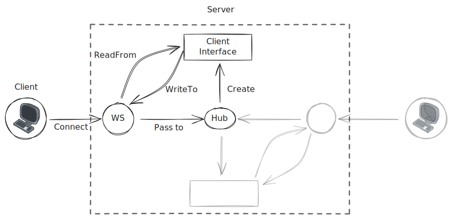

### Introduction
This project is a simple multiplayer game where players can compete to eat the most food. The client is built with Godot and the server is built with Go.

### Features
- Login and register
- In-game chat
- In-game leaderboard
- In-game scoreboard
- In-game game

### project structure
```sh
/
├── server/             # Go backend server
│   ├── cmd/           # Command line applications
│   ├── internal/      # Private application code
│   ├── pkg/           # Public libraries
│   ├── go.mod         # Go module file
│   └── Makefile       # Build automation
├── client/            # Godot client
│   └── scenes/        # Godot scenes
└── README.md          # Project documentation
```

### Details
#### Server

- long connection: websocket
- user management
  - db: sqlite
  - auth: bcrypt
- chat
  - broadcast
- scoreboard
- packet system
- gameplay
  - generate spores
  - player eat spores
  - player movement
- others
  - player movement's coordinates calculation based on direction
  - eating rule based on distance detection
  - player's grow and reset
  - spore's generation and deletion

### architecture
